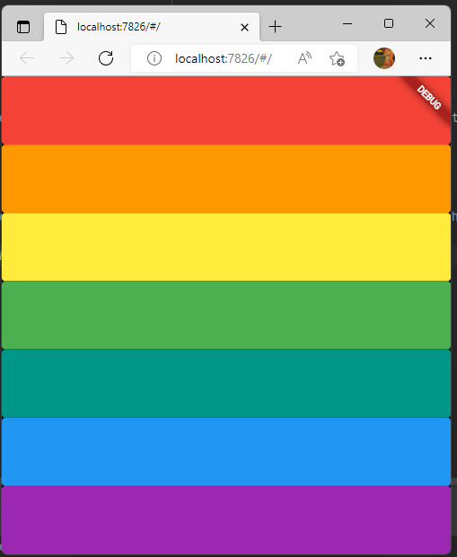

# Xylophone 🎹

- 选择用网页构建，项目引用了audioplayers库，而他只支持
  - ANDROID
  - IOS
  - MACOS
  - WEB

## Our Goal

In this tutorial we will be diving into more Dart programming concepts and learning how to use open source Flutter packages. By the end of this module, you should be comfortable using Flutter packages and building repeated widgets.

## What you will create

We’re going to make a music app that plays Xylophone sounds. For every Beethoven out there, this will let you unleash your musical talent where ever you are.

